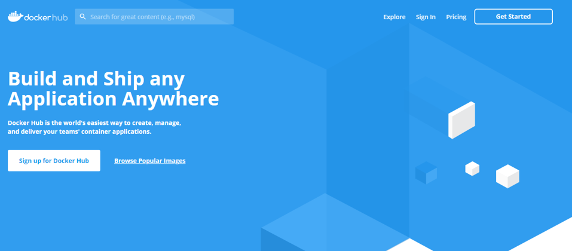

# 도커 실행

### 도커 설치

가장 먼저 도커를 설치합니다.

```bash
sudo apt update
sudo apt install -y docker.io python3-dev python3-pip mysql-client python-is-python3
sudo usermod -aG docker $USER
sudo reboot
```

### `docker run`
첫 컨테이너를 실행시켜 보겠습니다.

```bash
# docker run $REPO/$IMAGE_NAME:$TAG [$PARAMETERS..]
docker run docker/whalesay cowsay 'hello world!'
# Unable to find image 'docker/whalesay:latest' locally
# ....
#  ______________
# < hello world! >
#  --------------
#     \
#      \
#       \
#                     ##        .
#               ## ## ##       ==
#            ## ## ## ##      ===
#        /""""""""""""""""___/ ===
#   ~~~ {~~ ~~~~ ~~~ ~~~~ ~~ ~ /  ===- ~~~
#        \______ o          __/
#         \    \        __/
#           \____\______/
# 
```

$TAG를 생략시 자동으로 `latest` tag가 설정됩니다. 아래 명령은 위와 동일합니다.

```bash
# docker run $REPO/$IMAGE_NAME:$TAG [$PARAMETERS..]
docker run docker/whalesay:latest cowsay 'hello world!'
```

```bash
docker/whalesay == docker/whalesay:latest
```

다른 파라미터를 전달해 봅시다. (`echo hello`)

```bash
docker run docker/whalesay:latest echo hello
# hello
```

이미지 실행시 `-d` 옵션으로 통해 컨테이너를 백그라운드로 실행시킬 수도 있습니다.

```bash
# alpine이라는 이미지를 다음 파라미터로 실행  `sh -c "while true; do echo hello world; sleep 1; done`
# docker run에서 이미지가 없을 시, 자동으로 원격 저장소에서 이미지를 가져옵니다.
docker run -d ubuntu:18.04 sh -c "while true; do echo hello world; sleep 1; done"
```
*`-d`옵션을 통해 컨테이너 실행시, 컨테이너ID가 리턴됩니다.*

### `docker ps`

방금 실행한 컨테이너의 ID를 확인해 보겠습니다.

```bash
docker ps

# CONTAINER ID     IMAGE      COMMAND         CREATED         ...
# cbf17c6cf502     ubuntu     "sh -c .."      2 minutes ago   ...
```
*`CONTAINER_ID`는 사용자마다 다릅니다.*

### `docker logs`

백그라운드로 실행된 컨테이너의 로그를 직접 확인할 수 있습니다.
```bash
# docker logs -f $CONTAINER_ID

docker logs -f cbf17c6cf502
```

### `docker stop`

백그라운드로 실행된 컨테이너를 멈춥니다.
```bash
docker stop cbf17c6cf502
```

컨테이너를 멈추게 되면
`docker ps`에는 보이지 않지만 `-a` 옵셥을 전체 컨테이너를 확인할 수 있습니다.
```bash
docker ps -a
```

### `docker rm`

남아있는 컨테이너를 삭제합니다. (`-f`는 강제 삭제 옵션입니다.)
```bash
docker rm cbf17c6cf502 -f
```

### `docker exec`

`exec` 명령어는 실행된 컨테이너에 명령을 보내는 기능을 담당 합니다.
먼저 nginx 컨테이너를 하나 실행해 보겠습니다.

```bash
docker run -d nginx
```
`docker ps`를 통해 컨테이너ID를 획득 후, `exec`명령을 통해 `curl`을 설치해 보겠습니다.

```bash
docker ps
# Get CONTAINER_ID

docker exec $COND_ID apt update
docker exec $COND_ID apt install -y curl
docker exec $COND_ID curl localhost
```

### `docker cp`

컨테이너 내부와 호스트서버 간의 파일을 복사해 줍니다.

*`/usr/share/nginx/html/`은 nginx 서버의 default home 디렉토리입니다. 해당 디렉토리에 존재하는 파일들을 웹 서빙합니다.*

```bash
# 호스트에서 컨테이너로 파일 복사
docker cp /etc/passwd $COND_ID:/usr/share/nginx/html/.
# 확인
docker exec $COND_ID curl localhost/passwd

# 컨테이너에서 호스트로 파일 복사
docker cp $COND_ID:/usr/share/nginx/html/index.html .

# 확인
ls -al .
```


### Interactive 컨테이너

이미지를 실행시, `-it` 옵션을 통해 직접 컨테이너에 접속하여 작업할 수도 있습니다.
컨테이너 생성과 함께 접속
```bash
docker run -it ubuntu:16.04 bash

# inside container
$ root@1c23d59f4289:/#

$ root@1c23d59f4289:/# cat /etc/os-release
```

os 버전을 확인하면 16.04로 나오는 것을 확인할 수 있습니다.


이미 생성한 컨테이너에도 접속이 가능합니다. `exec -it` 명령을 이용하여 접속할 수 있습니다.

```bash
# 컨테이너 실행
docker run -d nginx

# 컨테이너ID 확인
docker ps 

# exec 명령을 통해서 bash 접속
docker exec -it $COND_ID bash
# inside container
$ root@1c23d59f4289:/#
```

### 컨테이너 상세 정보 확인

컨테이너의 상세 정보를 출력합니다. 네트워크, 볼륨 등 모든 메터 정보를 포함하고 있습니다.

```bash
# 다시 컨테이너 ID 확인
docker ps
# CONTAINER ID        IMAGE               COMMAND                  CREATED             STATUS              PORTS               NAMES
# d80e34dea778        nginx               "/docker-entrypoint.…"   5 minutes ago       Up 5 minutes        80/tcp              charming_lumiere

# 상세 정보 확인
docker inspect d80e34dea778
```

### 컨테이너 네트워크

지금까지 nginx 실행시, 컨테이너 내부에서 동작을 확인하였습니다. (`curl localhost`) 이것을 로컬 서버 포트와 연결시켜 실행해 보도록 하겠습니다.

```bash
# docker run -p $HOST_PORT:$CONTAINER_PORT $IMG
# 호스트의 5000번 포트를 컨테이너의 80포트와 매핑합니다.
docker run -p 5000:80 nginx
# /docker-entrypoint.sh: /docker-entrypoint.d/ is not empty, will attempt to perform configuration
# /docker-entrypoint.sh: Looking for shell scripts in /docker-entrypoint.d/
# /docker-entrypoint.sh: Launching /docker-entrypoint.d/10-listen-on-ipv6-by-default.sh
# 10-listen-on-ipv6-by-default.sh: Getting the checksum of /etc/nginx/conf.d/default.conf
# 10-listen-on-ipv6-by-default.sh: Enabled listen on IPv6 in /etc/nginx/conf.d/default.conf
# /docker-entrypoint.sh: Launching /docker-entrypoint.d/20-envsubst-on-templates.sh
# /docker-entrypoint.sh: Configuration complete; ready for start up
```

> 종료: <CTRL> + <C>

다시 백그라운드로 실행합니다. (`-d` 옵션)

```bash
docker run -p 5000:80 -d nginx

# 내부 IP로 접근 시
hostname -i
# 외부 IP로 접근 시
curl ifconfig.co

# 5000번으로 curl 호출을 합니다.
curl <내부 혹은 외부IP>:5000
```

이번에는 내부 혹은 외부 IP를 이용하여 직접 웹 브라우저에 입력합니다.

> 웹 브라우저 URL: `$IP:5000`

이를 통해 외부 트레픽을 컨테이너 내부까지 전달할 수 있게 됩니다.

### 컨테이너 볼륨

이미지 실행시, 네트워크 연결뿐만 아니라 로컬의 파일시스템을 컨테이너와 연결할 수 있습니다.

```bash
# docker run -v $HOST_DIR:$CONTAINER_DIR $IMG
# 현재 디렉토리를 컨테이너의 nginx 디렉토리와 연결합니다.
docker run -p 5500:80 -v $(pwd):/usr/share/nginx/html/ -d nginx

# 현재 디렉토리에 hello.txt 파일을 생성합니다.
echo hello! >> $(pwd)/hello.txt
# nginx 내부에서 해당 파일이 보이는지 확인합니다.
curl <내부 혹은 외부IP>:6000/hello.txt
# hello!
```

변경 사항이 많은 파일의 경우, 컨테이너 내부에 파일을 두지 않고 호스트 서버의 디렉토리를 연결하여, 호스트 서버에서 조금 더 손쉽게 파일을 수정할 수 있습니다. 또한 컨테이너는 컨테이너 종료시, 저장된 데이터가 사라지지만 볼륨을 이용하여 데이터를 저장하는 경우 데이터가 유실되지 않고 유지되는 장점이 있습니다.

---

## 이미지 원격 저장소

도커헙는 도커 이미지 원격 저장소입니다. 사용자들은 도커헙에 이미지를 업로드하고 다른 곳에서 자유롭게 재사용할 수 있습니다. 깃헙과 마찬가지로 퍼블릭 저장소는 무료로, 프라이빗 저장소에 대해서는 비용을 받습니다.

## 도커허브 계정 만들기

도커허브에 접속하여 (https://hub.docker.com/) 계정을 생성합니다.

*실습에서 <USERNAME> 위치에 각자의 도커허브 계정 이름을 입력합니다.*




그리고 난 후 nginx 레포지토리를 생성합니다. `Create Repository` > `Name` 에 nginx라고 기입합니다. > `Create`


### 이미지 tag 달기

이미지에서 새로운 이름을 부여할 수 있습니다. nginx 이미지에 새로운 이름 `<USERNAME>/nginx`를 달아(tag) 봅시다.

```bash
docker tag nginx <USERNAME>/nginx
```

### 이미지 버전 달기

tag를 부여할 때, 버전명도 함께 부여할 수 있습니다. nginx 이름에 새로운 이미지 `<USERNAME>/nginx:1` 이름 부여

```bash
docker tag nginx <USERNAME>/nginx:1
```

생략 시 `latest`가 입력됩니다.

### 이미지 확인

생성된 이미지 리스트를 확인합니다. 지금까지 사용하고 생성한 이미지 리스트가 보입니다.

```bash
docker images
# REPOSITORY          TAG                 IMAGE ID            CREATED              SIZE
# nginx               wget                e6a274cc5af1        About a minute ago   152MB
# nginx               curl                89b0e8f41524        2 minutes ago        150MB
# ubuntu              16.04               330ae480cb85        8 days ago           125MB
# ubuntu              latest              74435f89ab78        8 days ago           73.9MB
# ubuntu              18.04               8e4ce0a6ce69        8 days ago           64.2MB
# hongkunyoo/nginx    1                   2622e6cca7eb        2 weeks ago          132MB
# hongkunyoo/nginx    latest              2622e6cca7eb        2 weeks ago          132MB
# nginx               latest              2622e6cca7eb        2 weeks ago          132MB
# docker/whalesay     latest              6b362a9f73eb        5 years ago          247MB
```

*nginx:latest와 <USERNAME>/nginx:latest 이미지가 같은 IMAGE_ID를 가지고 있는 것을 확인해 보세요*


### 도커헙 로그인

도커헙에서 생성한 계정과 비밀번호를 입력하세요.

```bash
docker login
# Username: 
# Password: 
# WARNING! Your password will be stored unencrypted in /home/ubuntu/.docker/config.json.
# Configure a credential helper to remove this warning. See
# https://docs.docker.com/engine/reference/commandline/login/#credentials-store
# 
# Login Succeeded
```

### 이미지 업로드

이제 이미지를 업로드합니다.

```bash
docker push <USERNAME>/nginx
# The push refers to repository [docker.io/hongkunyoo/nginx]
# f978b9ed3f26: Preparing
# 9040af41bb66: Preparing
```

### 이미지 다운로드

반대로 다음과 같이 이미지를 다운로드 합니다. 이미 이미지가 로컬에 있기에 다시 다운로드 받지 않고 금방 끝납니다.

```bash
docker pull <USERNAME>/nginx
```

이번에는 `redis` 이미지를 다운로드 받아 보겠습니다.

```bash
docker pull redis
# Using default tag: latest
# latest: Pulling from library/redis
# 8559a31e96f4: Already exists
# 85a6a5c53ff0: Pull complete

docker images
```

### 이미지 삭제

도커헙에 있는 이미지가 아닌, 로컬 서버에 있는 이미지를 삭제합니다.

```bash
docker rmi <USERNAME>/nginx

docker images
```

이미지 삭제 후, 도커헙에서 다시 이미지를 다운 받을 수 있습니다.

```bash
docker pull <USERNAME>/nginx

docker images
```

---

## :trophy: Do it more #1

`docker exec $COND_ID curl localhost` 라는 명령을 실행했을 때, 아래와 같은 html 파일이 응답되게 만들어 주세요.

```bash
# run nginx
docker run -d nginx
# curl localhost
docker exec $COND_ID curl localhost
```

```html
<html>
    <body>
        <h1>Hello world!</h1>
    </body>
</html>
```

## :trophy: Do it more #2

다음과 같은 mysql 앱을 실행해주세요.

- 이미지 URL: `mysql`
- 사용할 포트: `3306`
- 필요한 환경변수
  - `MYSQL_ROOT_PASSWORD`: `root` 비밀번호
  - `MYSQL_USER`: 일반유저 이름
  - `MYSQL_PASSWORD`: 일반유저 비밀번호 

아래 명령을 입력하였을 때, 정상적으로 접속이 된다면 성공한 것입니다.

```bash
# 일반유저: ubuntu / 비밀번호: 1234 가정
$ mysql -h 127.0.0.1 -u ubuntu -p1234
```

컨테이너 실행명령을 `run.txt` 파일로 제출해 주세요.

예)
```bash
docker run .....
```
