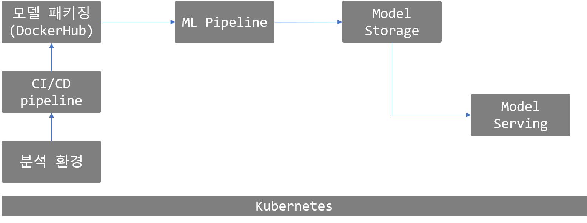

# Project

다음과 같은 AIOps 플랫폼을 구축하고자 합니다.

- JupyterHub에서 학습 코드를 개발한 이후
- 모델 소스코드를 CI/CD를 통해 패키징 및 실행합니다. (GitHub Actions)
- 패키징된 코드를 자동으로 ML Job(Pipeline)을 실행합니다.
- 생성된 모델 artifact는 모델 저장소에 저장합니다.
- 학습이 완료된 모델을 배포합니다.
- 사용자 REST 요청에 대해 정상적으로 응답을 합니다.

